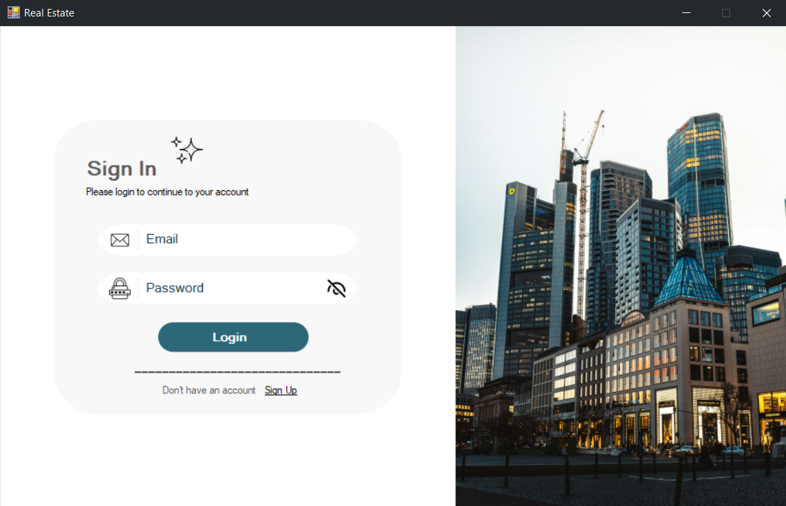
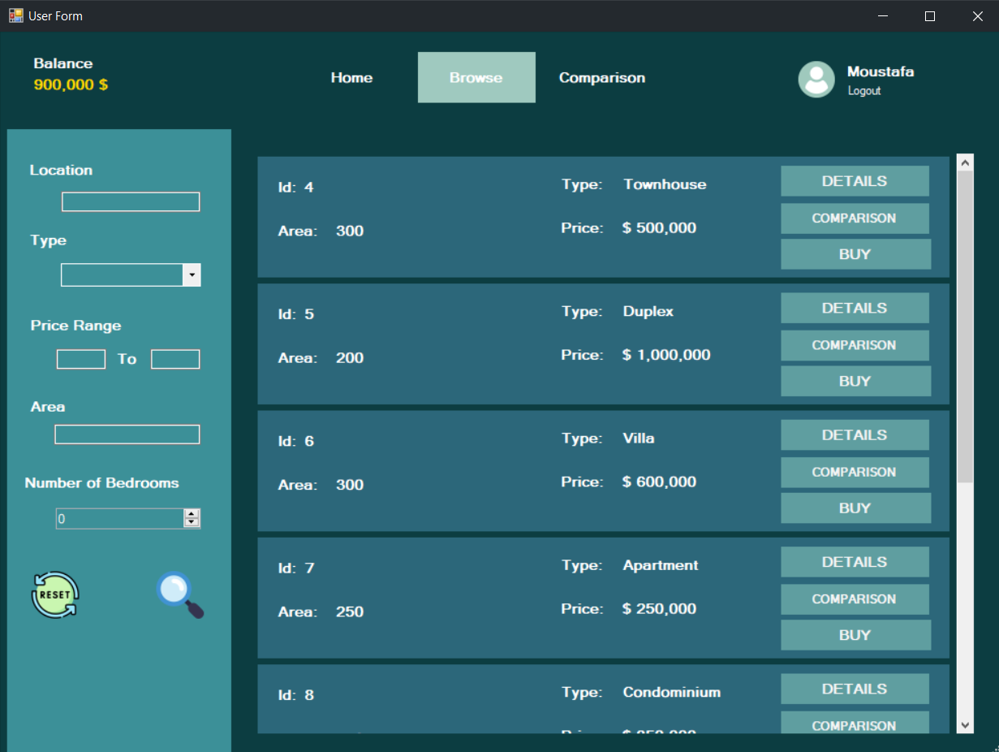
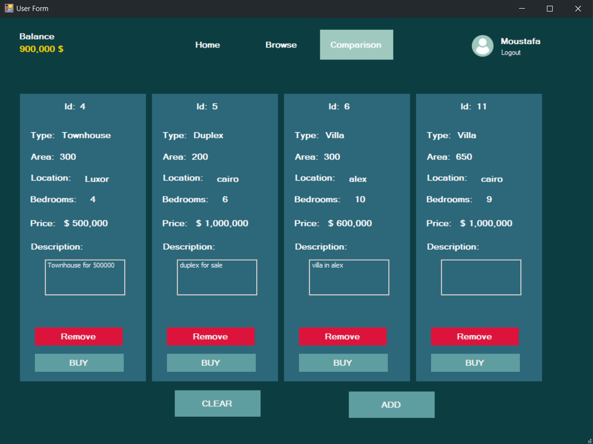
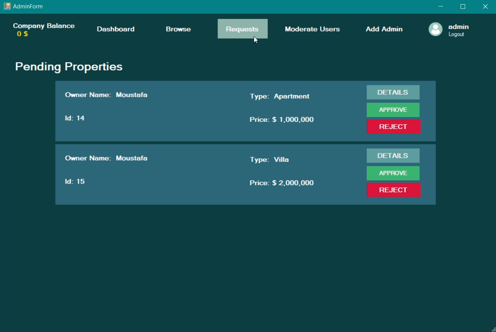
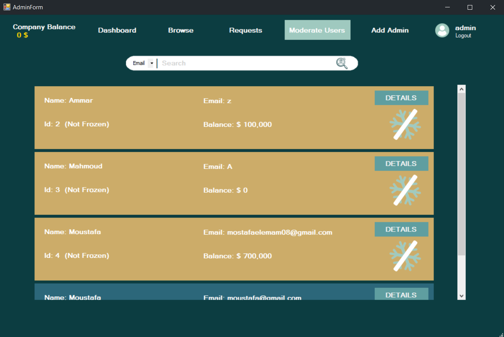

# 🏡 Real Estate Portal System
> A robust, GUI-driven property management platform built with C++ and Windows Forms, featuring a dual-tier architecture for Users and Administrators.
## 📌 Overview

This C++ project is a Real Estate Portal System built using Windows Forms. It enables users to explore, list, compare, and purchase properties. Admins manage listings and users, while data persistence is handled through local file storage.

---
## 🌟 Features

### 👤 User Functionality

- Register, log in, and manage profiles
- Add and edit properties (new listings are marked as pending until approved)
- Search with advanced filters (location, price, property type, square footage, bedrooms)
- Compare up to four properties side by side
- Purchase properties using credit card and account balance

### 🛠️ Admin Capabilities

- Access the admin dashboard
- Approve or reject user-submitted properties
- Edit, delete, or highlight any property
- All users can edit any property (admin-only functionality)
- Freeze/unfreeze user accounts to restrict submissions or purchases
- Company Balance: If a user buys a property owned by the company, the payment is transferred to a shared balance accessible to all admins

---

## 🎥 Demo Video

Watch a demo of the system in action:

📺 [View the Demo Video](https://drive.google.com/file/d/1WNIpxYEBx4u7I57l7Bez7z2WAFSm2YBP/view?usp=sharing)

---

## 📸 Screenshots

Here are some key visuals of the system in action:

### 🖼️ Sign In Page


### 🔍 User Search


### 📊 Comparison View


### 🛠️ Manage Requests (Admin)


### 🔒 Moderate Users


---

## 📃 Project Structure

```
Login_Page/
├── AdminForm.cpp/.h       → Admin interface
├── Authentication.cpp     → User login and signup logic
├── FileHandler.cpp/.h     → File I/O for users, properties, balances
├── Global.cpp/.h          → Shared utilities and variables
├── MainPage.cpp/.h        → Navigation and main interface
├── Property.cpp/.h        → Property class and features
├── UserForm.cpp/.h        → User interface
├── Users.cpp/.h           → User class and balance logic
├── Users.txt              → User data file
├── Properties.txt         → Property data file
├── CompanyBalance.txt     → Shared admin balance file
├── Login_Page.sln         → Visual Studio solution file
└── screenshots/           → GUI snapshots
```

---

## 📀 Data Structures Used

- `map` – for storing user accounts
- `list` – for managing property listings
- `queue` – for search processing

---

## 👥 Team Members

- Moustafa Mortada
- Ammar Mohamed
- Mahmoud Sherif
- Ali Yehia
- Mohamed Sadek

---

## ▶️ How to Run
1. Open `Login_Page.sln` in Visual Studio
2. Build the solution
3. Run the application

---

## 🔐 Default Admin Credentials

Email: admin@gmail.com

Password: 12345678

---

## 👩‍🏫 Course Professors

- Dr. Wedad Hussein
- Dr. Hanan Yousry

---

## 👏 Acknowledgements

We would like to express our sincere gratitude to our professors, Dr. Wedad Hussein and Dr. Hanan Yousry, for their valuable guidance and support throughout the course. Their insights greatly improved our learning experience.

